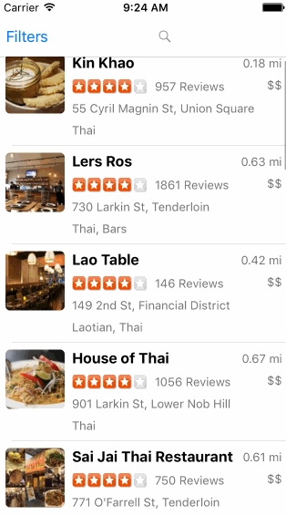

# Yelp - Assignment 2

A Yelp search app.

Submitted by: Alan Hamlett

Time spent: [coming soon][time spent coding]

## User Stories

The following **required** functionality is complete:

### Search Results Page

* [X] Table rows should be dynamic height according to the content height.
* [X] Custom cells should have the proper Auto Layout constraints.
* [ ] Search bar should be in the navigation bar (doesn't have to expand to show location like the real Yelp app does). Hint: This is just a UISearchBar that is set as the navigationItem.titleView

### Filter Page

* [ ] The filters you should actually have are: category, sort (best match, distance, highest rated), distance, deals (on/off).
* [ ] The filters table should be organized into sections as in the mock.
* [ ] You can use the default UISwitch for on/off states.
* [ ] Clicking on the "Search" button should dismiss the filters page and trigger the search w/ the new filter settings.
* [ ] Distance filter should expand as in the real Yelp app.
* [ ] Categories should show a subset of the full list with a "See All" row to expand.

The following **optional** features are implemented:

### Search Results Page

* [ ] Infinite scroll for restaurant results
* [ ] Implement map view of restaurant results

### Filter Page

* [ ] Implement the restaurant detail page.
* [ ] Implement a custom switch.

## Video Walkthrough

Here's a walkthrough of implemented user stories:

GIF created with [LiceCap](http://www.cockos.com/licecap/).

## Notes

Challenges encountered while building the app:

## License

    Copyright 2017 Alan Hamlett

    Licensed under the Apache License, Version 2.0 (the "License");
    you may not use this file except in compliance with the License.
    You may obtain a copy of the License at

        http://www.apache.org/licenses/LICENSE-2.0

    Unless required by applicable law or agreed to in writing, software
    distributed under the License is distributed on an "AS IS" BASIS,
    WITHOUT WARRANTIES OR CONDITIONS OF ANY KIND, either express or implied.
    See the License for the specific language governing permissions and
    limitations under the License.

[time spent coding]: https://wakatime.com/@alan
